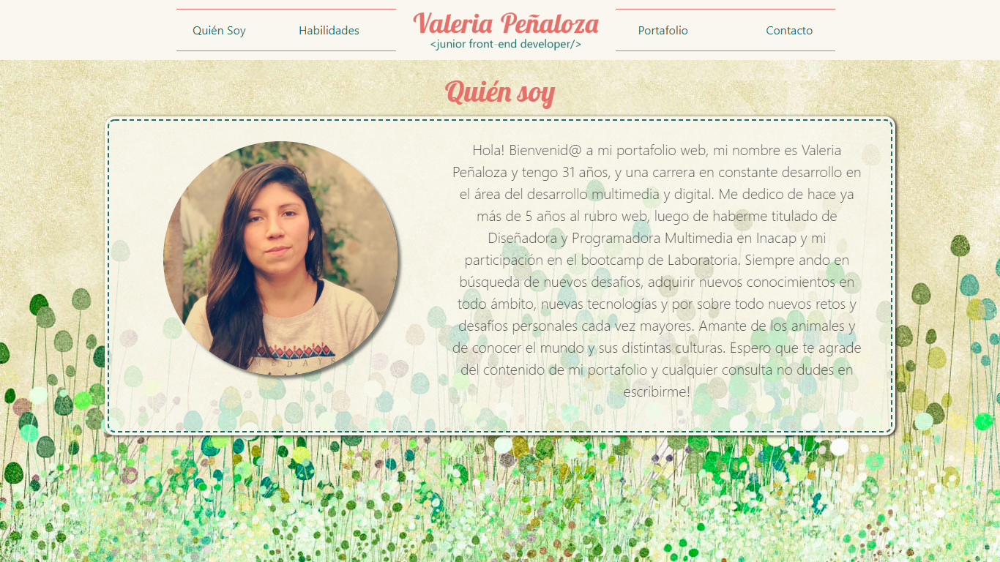
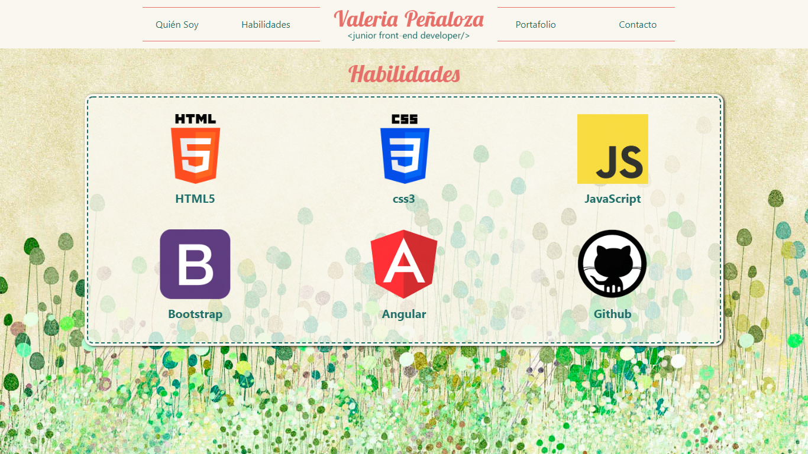
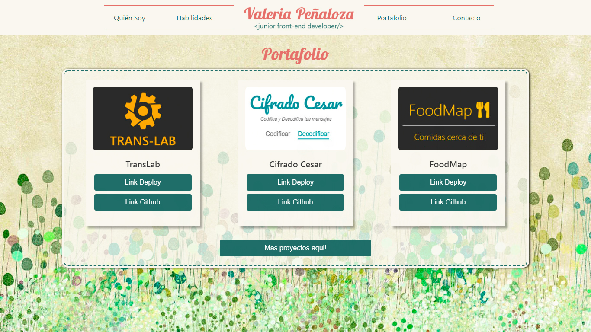
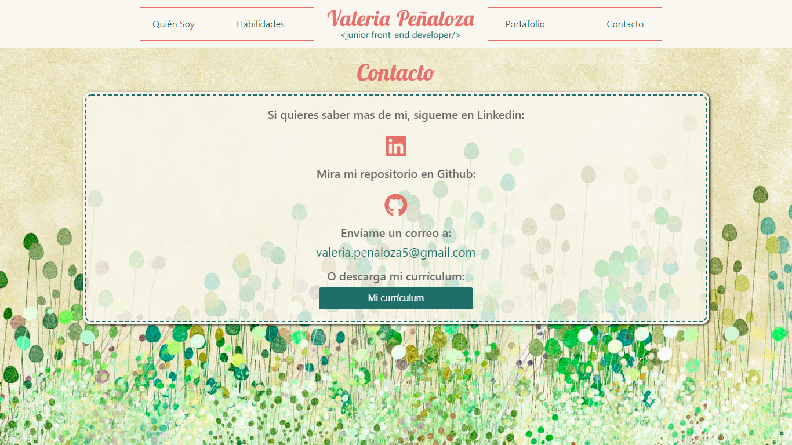
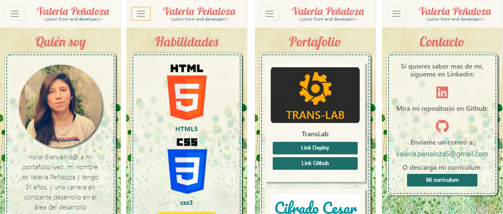

Hola! Bienvenid@ a mi portafolio web, mi nombre es Valeria Peñaloza y tengo 31 años, y una carrera en constante desarrollo en el área del desarrollo multimedia y digital. Me dedico de hace ya más de 5 años al rubro web, luego de haberme titulado de Diseñadora y Programadora Multimedia en Inacap y mi participación en el bootcamp de Laboratoria. Siempre ando en búsqueda de nuevos desafíos, adquirir nuevos conocimientos en todo ámbito, nuevas tecnologías y por sobre todo nuevos retos y desafíos personales cada vez mayores. Amante de los animales y de conocer el mundo y sus distintas culturas. Espero que te agrade del contenido de mi portafolio y cualquier consulta no dudes en escribirme!

## Tecnología usada

* Html5
* Css3
* Bootstrap
* Javascript
* Jquery

## Vistas

### versión desktop

### versión mobile

## Enlace Deploy

https://valepm0511.github.io/ValeriaPenalozaMartinez.github.io/

